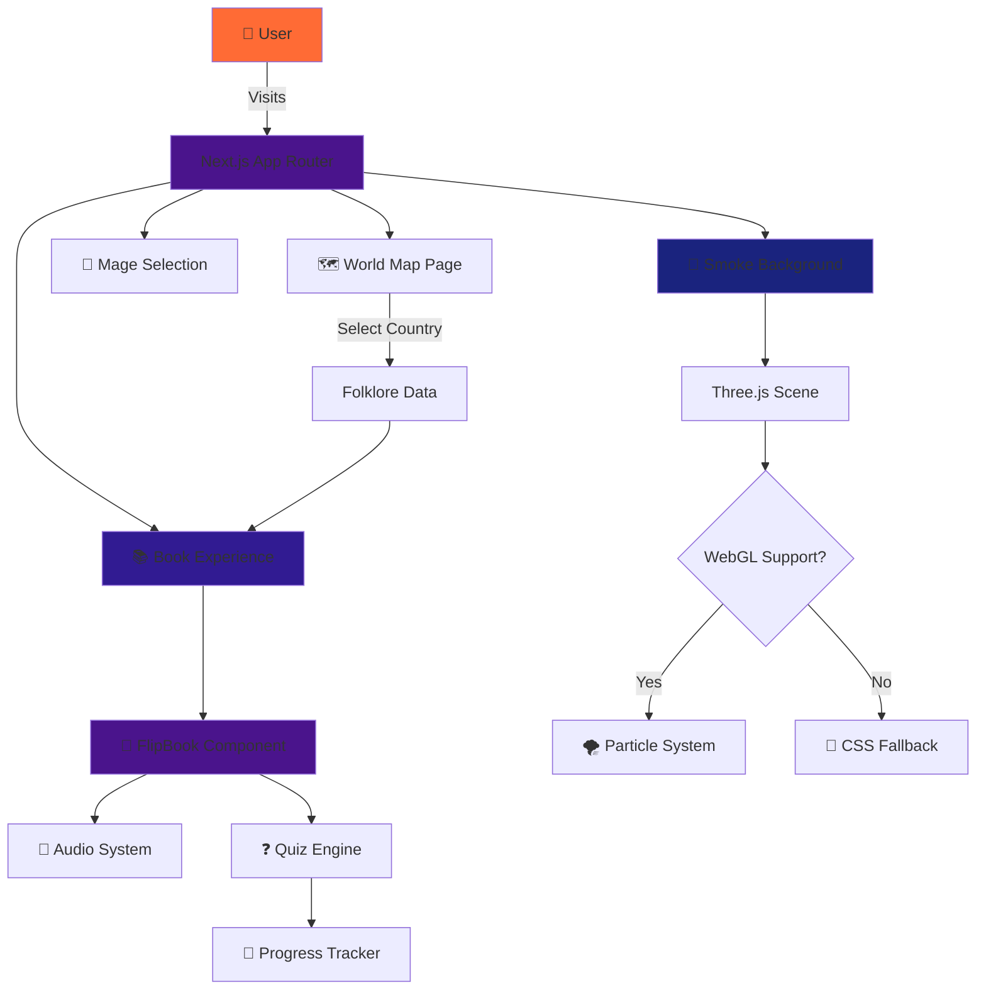
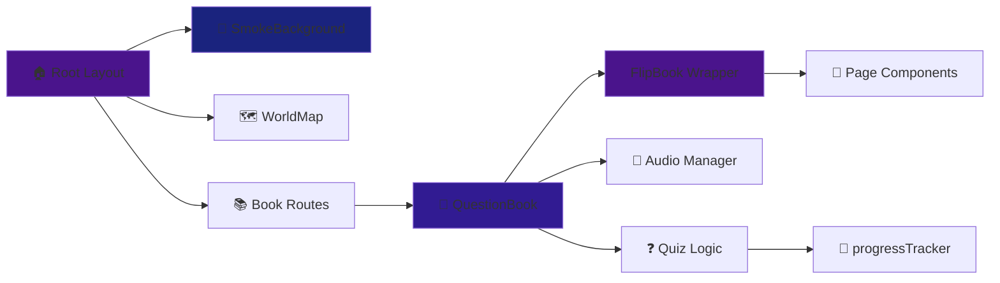
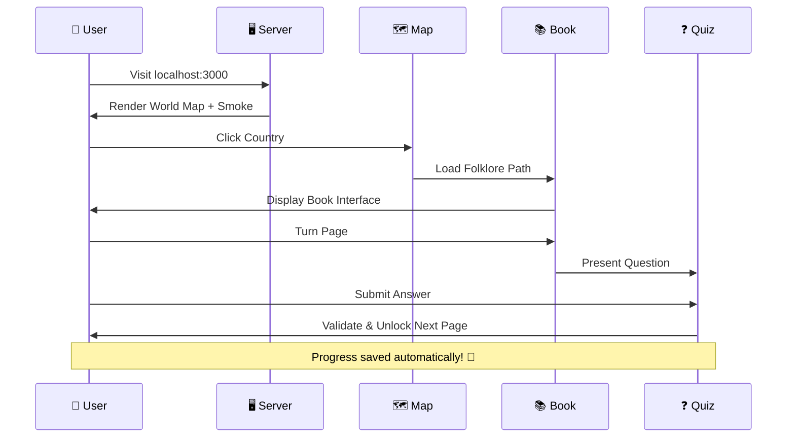
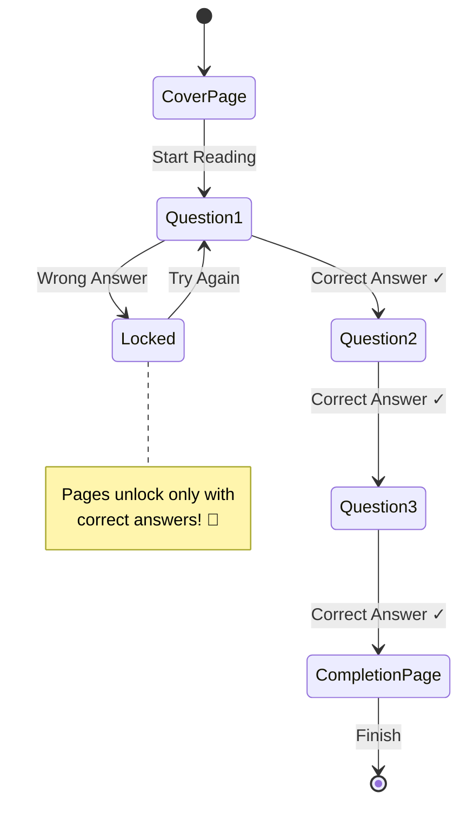
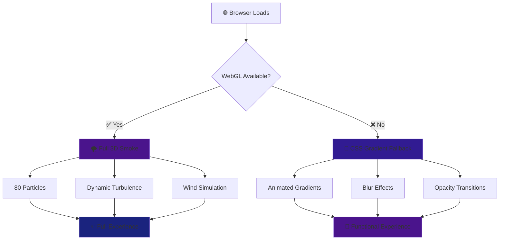

<div align="center">

```
╔═══════════════════════════════════════════════════════════════════════════╗
║                                                                           ║
║     ███████╗███████╗ █████╗ ███╗   ██╗ ██████╗███████╗                  ║
║     ██╔════╝██╔════╝██╔══██╗████╗  ██║██╔════╝██╔════╝                  ║
║     ███████╗█████╗  ███████║██╔██╗ ██║██║     █████╗                    ║
║     ╚════██║██╔══╝  ██╔══██║██║╚██╗██║██║     ██╔══╝                    ║
║     ███████║███████╗██║  ██║██║ ╚████║╚██████╗███████╗                  ║
║     ╚══════╝╚══════╝╚═╝  ╚═╝╚═╝  ╚═══╝ ╚═════╝╚══════╝                  ║
║                                                                           ║
║            🌙 Summon the Spirits of Dark Folklore 🌙                     ║
║                                                                           ║
╚═══════════════════════════════════════════════════════════════════════════╝
```

[](https://nextjs.org/)
[](https://reactjs.org/)
[](https://www.typescriptlang.org/)
[](https://threejs.org/)
[](https://github.com)
[](LICENSE)

### 🏆 Kiroween Hackathon 2025 - Costume Contest Entry 🏆

*A mystical web experience where ancient folklore meets cutting-edge 3D technology*

[🎃 Live Demo](#) • [📖 Documentation](#getting-started) • [🦇 Features](#features) • [👻 Contributing](#)

---

</div>

## 🕯️ About the Séance

**Séance** is an immersive Next.js web application that transports you into the shadowy realm of global dark folklore. Through the veil of cutting-edge 3D effects and atmospheric storytelling, users embark on a haunting journey across continents, uncovering the chilling tales that have terrified generations.

Born from the depths of the **Kiroween Hackathon 2025**, this project showcases the perfect marriage of modern web technologies and timeless horror. Every interaction is designed to send shivers down your spine—from the ethereal smoke that dances across your screen to the ancient tomes that reveal their secrets page by page.

> *"In the darkness, stories come alive. Will you dare to turn the page?"*

## ✨ Features

<div align="center">

```
🕸️━━━━━━━━━━━━━━━━━━━━━━━━━━━━━━━━━━━━━━━━━━━━━━━━━━━━━━━━━━━━━━━━🕸️
```

</div>

### 🗺️ Interactive World Map
Traverse the globe with an enchanted map powered by **react-simple-maps**. Click on any country to unveil its darkest folklore—from Japanese Yōkai to Slavic demons, from Celtic banshees to African trickster spirits. Each region holds secrets waiting to be discovered.

### 💨 Ethereal 3D Smoke Effects
Witness reality blur as supernatural smoke swirls across your screen. Built with **react-smoke** and **Three.js**, our particle system features:
- 🌪️ **Dynamic Turbulence**: Configurable chaos that mimics otherworldly winds
- 💨 **Multi-directional Wind Simulation**: 80+ particles dancing in haunting patterns
- ⚡ **WebGL-Powered Performance**: Smooth 60fps animations with graceful CSS fallbacks
- 🎭 **Atmospheric Opacity**: Perfectly balanced to enhance, not overwhelm

### 📚 Ancient Tome Interface
Turn the pages of forbidden knowledge with our **react-pageflip** book system:
- 📖 **Realistic Page Physics**: 600ms flip animations with authentic shadows
- 🔊 **Haunting Audio Feedback**: Crisp page-turn sounds immerse you deeper
- 📱 **Touch & Swipe Gestures**: Mobile-optimized for séances on the go
- 🎯 **Smart Pagination**: Questions flow naturally across left/right spreads
- 🔒 **Progressive Unlocking**: Earn your way through the grimoire

### 🎓 Educational Quiz System
Learn while you're spooked! Our interactive quiz system features:
- ❓ **Contextual Questions**: Deep dives into cultural history and mythology
- ✅ **Instant Validation**: Immediate feedback with detailed explanations
- 🏆 **Score Tracking**: Monitor your folklore mastery
- 🎯 **Smart Progression**: Answer correctly to unlock new chapters

### 💾 Progress Persistence
Your journey through darkness is never lost. LocalStorage-based tracking ensures:
- 📊 **Score Retention**: All achievements saved automatically
- 🔄 **Resume Capability**: Pick up exactly where you left off
- 🎮 **Multiple Paths**: Track progress across different folklore routes

### 📱 Responsive & Accessible
Experience the supernatural on any device:
- 🖥️ **Desktop Optimized**: Full WebGL glory on powerful machines
- 📱 **Mobile Ready**: Touch-friendly with performance optimizations
- ♿ **Accessible**: Keyboard navigation and screen reader support
- 🎨 **Dark Mode Native**: Designed for the shadows

## 🛠️ Technology Stack

<div align="center">

```
👻━━━━━━━━━━━━━━━━━━━━━━━━━━━━━━━━━━━━━━━━━━━━━━━━━━━━━━━━━━━━━━━━👻
```

</div>

Our mystical tech grimoire combines bleeding-edge frameworks with powerful libraries:

| Category | Technology | Purpose |
|----------|-----------|---------|
| 🎯 **Framework** | Next.js 16.0.1 | App Router, SSR, and optimal performance |
| ⚛️ **UI Library** | React 19.2.0 | Concurrent features and modern hooks |
| 📘 **Type Safety** | TypeScript 5 | Compile-time safety and IntelliSense |
| 🎨 **Styling** | Tailwind CSS 4 | Utility-first responsive design |
| 🌌 **3D Graphics** | Three.js 0.181.0 | WebGL rendering engine |
| 🎭 **3D React** | React Three Fiber 9.4.0 | Declarative Three.js in React |
| 💨 **Particle FX** | react-smoke 1.2.0 | Atmospheric smoke effects |
| 📖 **Page Flips** | react-pageflip 2.0.3 | Realistic book animations |
| 🗺️ **Maps** | react-simple-maps 3.0.0 | SVG-based world visualization |
| 🔧 **Tooling** | Biome 2.2.0 | Lightning-fast linting & formatting |

### 🏗️ Architecture Overview



### 🎭 Component Hierarchy



## 🚀 Getting Started

<div align="center">

```
🦇━━━━━━━━━━━━━━━━━━━━━━━━━━━━━━━━━━━━━━━━━━━━━━━━━━━━━━━━━━━━━━━━🦇
```

</div>

### 📋 Prerequisites

Before summoning the spirits, ensure you have:
- 🟢 **Node.js** 18.x or higher
- 📦 **pnpm** 8.x or higher (recommended) or npm/yarn
- 🌐 **Modern browser** with WebGL support (Chrome, Firefox, Safari, Edge)

### 🔮 Installation Ritual

**Step 1:** Clone the repository from the shadow realm
```bash
git clone https://github.com/yourusername/seance.git
cd seance
```

**Step 2:** Summon the dependencies
```bash
pnpm install
```

**Step 3:** Configure your environment (optional)
```bash
cp .env.example .env.local
# Edit .env.local with your mystical configurations
```

**Step 4:** Awaken the development server
```bash
pnpm dev
```

**Step 5:** Open the portal
Navigate to [http://localhost:3000](http://localhost:3000) and witness the magic unfold! 🎃

### 🎬 Quick Start Flow



## 📂 Project Structure

<div align="center">

```
🕷️━━━━━━━━━━━━━━━━━━━━━━━━━━━━━━━━━━━━━━━━━━━━━━━━━━━━━━━━━━━━━━━━🕷️
```

</div>

```
séance/
├── 🎨 src/app/                      # Next.js App Router
│   ├── 🧩 components/               # Reusable React components
│   │   ├── 💨 SmokeBackground.tsx   # 3D smoke with WebGL + CSS fallback
│   │   ├── 🗺️ WorldMap.tsx          # Interactive folklore map
│   │   ├── 📖 FlipBook.tsx          # Enhanced page-flip wrapper
│   │   └── 👻 SpookyBook.tsx        # Themed book interface
│   │
│   ├── 📚 book/                     # Book reading experience
│   │   ├── components/
│   │   │   └── ❓ QuestionBook.tsx  # Quiz book with audio
│   │   ├── 📊 data.ts               # Folklore questions database
│   │   ├── 📘 types.ts              # TypeScript interfaces
│   │   └── 🎯 page.tsx              # Book route handler
│   │
│   ├── 🧙 mage/                     # Character selection
│   │   └── 🎯 page.tsx
│   │
│   ├── 🔧 lib/                      # Utility functions
│   │   └── 💾 progressTracker.ts    # LocalStorage persistence
│   │
│   ├── 🏠 page.tsx                  # Home page with world map
│   ├── 🎨 globals.css               # Global styles
│   └── 🖼️ image.css                 # Image-specific styles
│
├── 🎃 public/                       # Static assets
│   ├── 🎵 sound/
│   │   └── pageflip.mp3             # Page turn audio
│   ├── 🖼️ assets/                   # Images and graphics
│   └── 🎨 paint-font/               # Custom fonts
│
├── ⚙️ Configuration Files
│   ├── 📦 package.json              # Dependencies & scripts
│   ├── 🔧 next.config.ts            # Next.js configuration
│   ├── 📘 tsconfig.json             # TypeScript settings
│   ├── 🎨 biome.json                # Linter/formatter config
│   ├── 🎨 postcss.config.mjs        # PostCSS setup
│   └── 🔐 .env.local                # Environment variables
│
└── 📖 README.md                     # You are here! 👻
```

## 📖 The Ancient Tome: Book Configuration

<div align="center">

```
💀━━━━━━━━━━━━━━━━━━━━━━━━━━━━━━━━━━━━━━━━━━━━━━━━━━━━━━━━━━━━━━━━💀
```

</div>

Our **FlipBook** component is a custom-crafted wrapper around react-pageflip, enchanted with additional powers:

### 🎭 Component Specifications

| Feature | Configuration | Purpose |
|---------|--------------|---------|
| 📐 **Dimensions** | 640px × 480px | Consistent cross-device experience |
| ⏱️ **Animation** | 600ms flip timing | Realistic page physics |
| 🎨 **Shadows** | Dynamic depth | Authentic book appearance |
| 👆 **Interactions** | Touch, mouse, swipe | Universal device support |
| 📏 **Swipe Distance** | 30px threshold | Precise gesture control |
| 🚫 **Click-to-Flip** | Disabled | Intentional navigation only |
| ♿ **Accessibility** | Full keyboard + SR | Inclusive experience |

### ✨ Mystical Enhancements

#### 🎮 Imperative API
Control the grimoire programmatically:
```typescript
interface FlipBookRef {
  flipNext: () => void;              // Turn to next page
  turnToPage: (page: number) => void; // Jump to specific page
  pageFlip: () => any;               // Access raw pageflip instance
}
```

#### 🎨 Custom Page Styling
- 📜 Parchment-like texture and appearance
- 🖋️ Aged paper aesthetic with subtle gradients
- 🔤 Custom typography for immersive reading

#### 🎵 Audio Integration
- 🔊 Page flip sound effects (volume: 0.5)
- 🛡️ Graceful failure handling for audio issues
- 🎧 Enhances immersion without being intrusive

#### 📱 Mobile Optimization
- 👆 Touch-friendly hit targets
- 📲 Swipe gestures for natural page turning
- ⚡ Performance optimized for mobile GPUs

### 🔒 Smart Page Progression System



**Progressive Unlocking Features:**
- 🎯 Answer correctly to unlock subsequent pages
- 👈👉 Contextual prompts for left/right page navigation
- 🚦 Visual indicators show page accessibility status
- 💾 Progress persists across sessions
- 🎓 Educational flow maintained through controlled access

## 🎯 Available Scripts

<div align="center">

```
🌙━━━━━━━━━━━━━━━━━━━━━━━━━━━━━━━━━━━━━━━━━━━━━━━━━━━━━━━━━━━━━━━━🌙
```

</div>

Invoke these incantations to control your development environment:

| Command | Spell Effect | Use Case |
|---------|-------------|----------|
| `pnpm dev` | 🔥 Summon development server | Local development with hot reload |
| `pnpm build` | 🏗️ Forge production artifact | Optimize and bundle for deployment |
| `pnpm start` | 🚀 Launch production server | Serve the optimized build |
| `pnpm lint` | 🔍 Scan for code anomalies | Run Biome linter checks |
| `pnpm format` | ✨ Beautify the codebase | Auto-format with Biome |

### 🧪 Development Workflow

```bash
# 1. Start the development séance
pnpm dev

# 2. Make your mystical changes
# ... edit files ...

# 3. Check for code spirits (lint)
pnpm lint

# 4. Banish formatting demons
pnpm format

# 5. Build for the mortal realm
pnpm build

# 6. Test the production incantation
pnpm start
```

## 🆕 Recent Enchantments

<div align="center">

```
🕸️━━━━━━━━━━━━━━━━━━━━━━━━━━━━━━━━━━━━━━━━━━━━━━━━━━━━━━━━━━━━━━━━🕸️
```

</div>

### 💨 Smoke Effects Overhaul (v2.0)
- ✅ **react-smoke Integration**: Fixed import issues, now using correct `SmokeScene` API
- 🌪️ **Advanced Configuration**: Turbulence, wind vectors, and particle density controls
- 🎨 **Enhanced Fallback**: Beautiful CSS gradients for non-WebGL browsers
- ⚡ **Performance Tuning**: Optimized for 60fps on mobile and desktop

### 📚 Book System Refinements
- 🔊 **Audio System**: Crisp page-flip sounds with graceful error handling
- 🎯 **Smart Pagination**: Questions flow naturally across spreads
- 💾 **Progress Persistence**: LocalStorage-based save system
- 📱 **Mobile UX**: Improved touch targets and swipe gestures

### 🗺️ Map Interactions
- 🎨 **Visual Polish**: Hover effects and country highlighting
- 🔗 **Deep Linking**: Direct URLs to specific folklore paths
- 📊 **Analytics Ready**: Event tracking for user journeys

## Quiz System

The interactive book features an advanced quiz system with the following capabilities:

### Smart Page Progression
- Questions are distributed across book pages with proper left/right page layout
- Users must answer questions correctly to unlock subsequent pages
- Page access is controlled to maintain quiz integrity and educational flow
- Visual indicators show whether you're on a left or right page of the spread

### User Experience Features
- **Progressive Unlocking**: Only accessible pages can be turned, preventing users from skipping ahead
- **Contextual Navigation**: Different prompts for left vs right pages (continue on spread vs turn page)
- **Answer Validation**: Immediate feedback with explanations for both correct and incorrect answers
- **Progress Persistence**: Scores and completion status are saved locally using localStorage
- **Graceful Fallbacks**: Robust error handling for edge cases and invalid states
- **Imperative Control**: Programmatic page navigation through exposed FlipBook methods

### Book Structure
- **Cover Page**: Themed introduction with country and path information
- **Question Pages**: Interactive quiz content with multiple choice answers
- **Completion Page**: Final score display with personalized messages based on performance

### 🎮 FlipBook API Reference

The FlipBook component exposes a powerful imperative API through refs:

```typescript
interface FlipBookRef {
  flipNext: () => void;                    // Turn to next page
  turnToPage: (page: number) => void;      // Jump to specific page
  pageFlip: () => any;                     // Access raw pageflip instance
}
```

**Usage Example:**
```typescript
import { useRef } from 'react';
import FlipBook, { FlipBookRef } from '@/components/FlipBook';

function MyGrimoire() {
  const bookRef = useRef<FlipBookRef>(null);

  // 📖 Turn to next page programmatically
  const handleNext = () => {
    bookRef.current?.flipNext();
  };

  // 🎯 Jump to specific page
  const goToPage = (pageNumber: number) => {
    bookRef.current?.turnToPage(pageNumber);
  };

  // 🔧 Access raw pageflip for advanced control
  const getPageCount = () => {
    return bookRef.current?.pageFlip()?.getPageCount();
  };

  return (
    <FlipBook ref={bookRef}>
      {/* Your mystical pages here */}
    </FlipBook>
  );
}
```

## 🌌 WebGL & Performance

<div align="center">

```
🦇━━━━━━━━━━━━━━━━━━━━━━━━━━━━━━━━━━━━━━━━━━━━━━━━━━━━━━━━━━━━━━━━🦇
```

</div>

### 💨 Smoke Effects Engine

Our ethereal smoke system leverages **WebGL** through **react-smoke** and **Three.js** for maximum visual impact:

#### 🎛️ Configuration Parameters

```typescript
{
  turbulence: {
    enabled: true,
    strength: [0.08, 0.08, 0.08]  // Natural chaotic movement
  },
  wind: {
    strength: [0.06, 0.04, 0.02],  // Multi-directional flow
    direction: [1, 0.5, 0]         // Diagonal drift
  },
  particles: {
    count: 80,                      // Optimal density
    opacity: 0.6                    // Atmospheric without overwhelming
  },
  rotation: [0, 0, 0.02]           // Subtle spin for realism
}
```

#### 🎨 Graceful Degradation



### ⚡ Performance Benchmarks

| Device Type | FPS | Particle Count | Load Time |
|-------------|-----|----------------|-----------|
| 🖥️ Desktop (High-end) | 60 | 80 | < 2s |
| 💻 Laptop (Mid-range) | 60 | 80 | < 3s |
| 📱 Mobile (Modern) | 45-60 | 60 | < 4s |
| 📱 Mobile (Older) | 30-45 | CSS Fallback | < 2s |

### 🛡️ Browser Compatibility

| Browser | Version | WebGL | Status |
|---------|---------|-------|--------|
| 🌐 Chrome | 90+ | ✅ | Full Support |
| 🦊 Firefox | 88+ | ✅ | Full Support |
| 🧭 Safari | 14+ | ✅ | Full Support |
| 🌊 Edge | 90+ | ✅ | Full Support |
| 📱 Mobile Safari | iOS 14+ | ✅ | Full Support |
| 📱 Chrome Mobile | 90+ | ✅ | Full Support |

## 📸 Screenshots & Visuals

<div align="center">

```
🕸️━━━━━━━━━━━━━━━━━━━━━━━━━━━━━━━━━━━━━━━━━━━━━━━━━━━━━━━━━━━━━━━━🕸️
```

</div>

### 🗺️ World Map Interface
*Coming soon: Haunting screenshot of the interactive world map with ethereal smoke effects*

```
┌─────────────────────────────────────────────────────────────┐
│                                                             │
│     🌍 Interactive World Map with Smoke Effects 💨         │
│                                                             │
│  [Placeholder for screenshot showing the mystical world    │
│   map interface with countries highlighted and smoke       │
│   particles dancing across the screen]                     │
│                                                             │
└─────────────────────────────────────────────────────────────┘
```

### 📚 Book Reading Experience
*Coming soon: The ancient tome interface with page-flip animation*

```
┌─────────────────────────────────────────────────────────────┐
│                                                             │
│     📖 Immersive Book Interface with Quiz System ❓         │
│                                                             │
│  [Placeholder for screenshot showing the book interface    │
│   with parchment-like pages, quiz questions, and           │
│   navigation controls]                                     │
│                                                             │
└─────────────────────────────────────────────────────────────┘
```

### 🧙 Character Selection
*Coming soon: The mystical mage selection screen*

```
┌─────────────────────────────────────────────────────────────┐
│                                                             │
│     🧙‍♂️ Choose Your Path Through the Darkness 🌙            │
│                                                             │
│  [Placeholder for screenshot showing character/path        │
│   selection with atmospheric effects]                      │
│                                                             │
└─────────────────────────────────────────────────────────────┘
```

## 🎃 Kiroween Hackathon 2025

<div align="center">

```
╔═══════════════════════════════════════════════════════════════╗
║                                                               ║
║   🏆 COSTUME CONTEST ENTRY - POLISHED UI CATEGORY 🏆         ║
║                                                               ║
║   This project showcases the perfect blend of:               ║
║   • Cutting-edge web technologies                            ║
║   • Immersive 3D effects and animations                      ║
║   • Educational content wrapped in entertainment             ║
║   • Accessible, responsive design                            ║
║   • Dark, atmospheric aesthetic                              ║
║                                                               ║
║   Built with passion during Kiroween Hackathon 2025 🎃       ║
║                                                               ║
╚═══════════════════════════════════════════════════════════════╝
```

</div>
## 🤝 Contributing

We welcome contributions from fellow spirit summoners! Here's how you can help:

1. 🍴 Fork the repository
2. 🌿 Create a feature branch (`git checkout -b feature/AmazingFeature`)
3. ✨ Commit your changes (`git commit -m 'Add some AmazingFeature'`)
4. 📤 Push to the branch (`git push origin feature/AmazingFeature`)
5. 🎯 Open a Pull Request

### 🐛 Found a Bug?
Open an issue with:
- 📝 Clear description of the problem
- 🔄 Steps to reproduce
- 💻 Your environment (browser, OS, device)
- 📸 Screenshots if applicable


## 📜 License

This project is licensed under the **MIT License** - see the [LICENSE](LICENSE) file for details.

## 🙏 Acknowledgments

- 🎃 **Kiroween Hackathon** organizers for the spooky inspiration
- 👻 **Open source community** for the amazing libraries
- 🌍 **Folklore enthusiasts** worldwide for preserving these dark tales
- 🎨 **Contributors** who helped bring this séance to life

---

<div align="center">

```
╔═══════════════════════════════════════════════════════════════════╗
║                                                                   ║
║              Made with 🖤 and a touch of darkness                 ║
║                                                                   ║
║         "In every shadow, there's a story waiting..."            ║
║                                                                   ║
║                    🕯️ Séance © 2025 🕯️                           ║
║                                                                   ║
╚═══════════════════════════════════════════════════════════════════╝
```


**[⬆ Back to Top](#)**

</div>